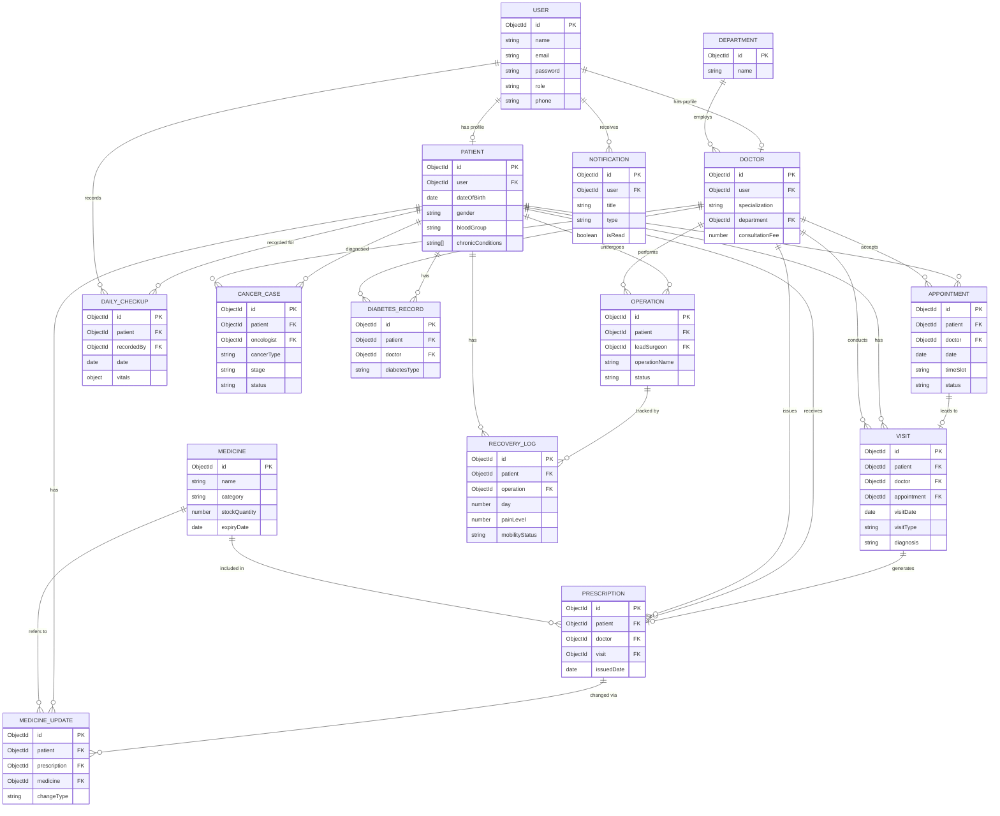

# Entity Relationship Diagram

## Notes on relationships

- **User → Patient / Doctor**: one `User` account extends into exactly one role-specific profile (`Patient` or `Doctor`), keeping auth separate from medical/professional data.
- **Appointment → Visit**: an appointment is the *booking*; a visit is what actually happened when the patient showed up. Walk-ins create a `Visit` with no linked `Appointment`.
- **Visit → Prescription**: prescriptions are usually tied to a visit, but can also be issued standalone (e.g. refill without a visit).
- **Prescription → MedicineUpdate**: instead of rewriting a prescription every time a dosage changes, updates are logged as their own timeline against the original prescription.
- **CancerCase / DiabetesRecord / Operation → RecoveryLog**: these are specialized care modules that sit alongside the general `Visit`/`Prescription` flow, each with domain-specific fields (chemo cycles, sugar logs, recovery milestones).
